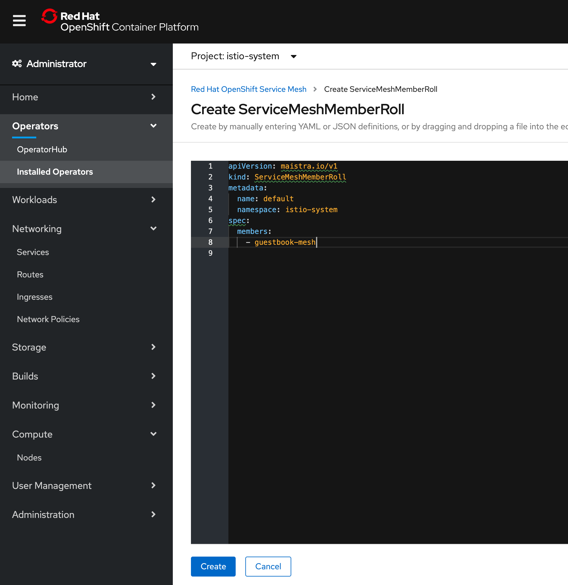

# Exercise 2 - Installing OpenShift Service Mesh

## Introduction

The OpenShift Service Mesh is a layer built on top of Istio, based on the Maistra operator.  In this pattern, we show how to take the microservice based application and
make the necessary modifications to deployment scripts, Dockerfiles and network policies to allow it to work with Istio service mesh.  Although the primary goal is security provided by mTLS between services and via the ingress, once Istio is configured, you have all the flexibility of its traffic management and security policies.  In this example, we will install OpenShift Service mesh and configure the Example Bank project to use mutual TLS between services.  Once inside the Istio mesh, you can also take advantage of its traffic management, telemetry and observability features.

## Included Components

- [OpenShift ServiceMesh](https://docs.openshift.com/container-platform/4.3/service_mesh)

## OpenShift Service Mesh vs. Istio

You will see the term "maistra" appear - this is the name of the operator used to implement the OpenShift ServiceMesh. The version of Istio available with OpenShift 4.3 is 1.4.6. 

See the differences between the OpenShift service mesh and upstream Istio here:

- [Comparison with Istio](https://maistra.io/docs/comparison-with-istio/)
- [OpenShift Service Mesh Architecture](https://docs.openshift.com/container-platform/4.3/service_mesh/service_mesh_arch/ossm-vs-community.html#ossm-vs-community)
- [Maistra releases](https://maistra.io/docs/installation/release-notes/)

# Prerequisites

1. Log in, or create an account on [IBM Cloud](https://cloud.ibm.com)
2. Provision an OpenShift 4.3 cluster on on [IBM Cloud](https://cloud.ibm.com/docs/openshift?topic=openshift-openshift_tutorial)
3. Create a [project](https://docs.openshift.com/container-platform/4.3/applications/projects/configuring-project-creation.html) called `guestbook-mesh`.

## Installing the OSSM Operator

Follow the instructions to install the necessary operators, in this order. (Note: `OSSM` stands for "OpenShift ServiceMesh").

1. ElasticSearch Operator
2. Jaeger Operator
3. Kialie Operator
4. Red Had OpenShift ServiceMesh Operator

Official instructions are here: https://docs.openshift.com/container-platform/4.3/service_mesh/service_mesh_install/installing-ossm.html#ossm-operatorhub-install_installing-ossm

Once complete, your "Installed Operators" screen will show these operators installed.


## Step 3: Control Plane and Member Roll

In this step, we'll use the OSSM operator to create two new instance - a Control Plane and a Service Mesh Member Roll. we'll install the control plane into the `istio-system` project

Create a new project called `istio-system`. After creation, select the `istio-system` project so that it is active. Then selected **Installed Operators -> Red Hat OpenShift Service Mesh**. Note that it may take a few seconds for the installed operators to be copied over to the new project.

- Install the Control Plane. No changes from the default template are needed.


- Install the OpenShift Member Roll (Sometimes abbreviated `SMMR`). One change is needed to the default template. You need to insert which namespaces this Member Roll applies to. In our case, set to `guestbook-mesh`. Application pods that are part of an `SMMR` will be managed by this Istio control plane  (e.g. sidecars will not be injected into pods in namespaces not part of a ServiceMesh Member Roll.)



And click "create".

You can verify the project is in the mesh member roll with this (note: requires the OpenShift `oc` CLI.)

```
$ oc get smmr -o yaml --all-namespaces | egrep -A2 'ControlPlane|configuredMembers'
kind: ServiceMeshControlPlane
name: basic-install
uid: 21b19fb5-f8c4-4ab0-831a-86e335ad9999
--
configuredMembers:
- example-bank
meshGeneration: 8
```
## [Continue to Exercise 3 - Deploy Guestbook with Istio Proxy](../exercise-3/README.md)
