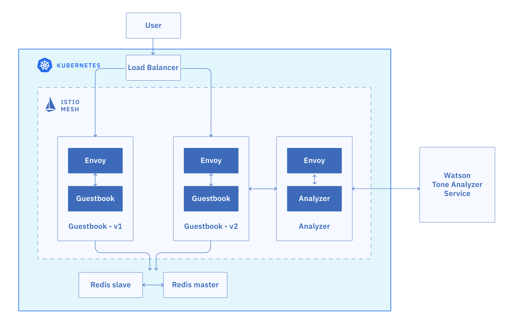

# Exercise 3 - Deploy the Guestbook app with Istio Proxy

The Guestbook app is a sample app for users to leave comments. It consists of a web front end, Redis master for storage, and a replicated set of Redis slaves.



## Download the Guestbook app

1. Clone the Guestbook app into the `workshop` directory.

    ```shell
    git clone  -b kubecon2019 https://github.com/jzaccone/guestbook
    ```

1. Navigate into the app directory.

    ```shell
    cd guestbook/v2
    ```

## Enable sidecar injection for the deployments

In Kubernetes, a sidecar is a utility container in the pod, and its purpose is to support the main container. For Istio to work, Envoy proxies must be deployed as sidecars to each pod of the deployment. In OpenShift, automatic sidecar injection at the namespace level is not allowed to allow explicit consent for applications to be apart of the mesh. Therefore, each deployment must have an additional annotation to indicate that its pods are to be deployed with a sidecar service container (and are participating in the mesh). 

The annotation is `sidecar.istio.io/inject: "true"` as follows:

```sh
template:
  metadata:
    labels:
      app: mobile-simulator
    annotations:
      sidecar.istio.io/inject: "true"
```

These changes have been made for you. You can review these in any of the deployment yaml files, such as `guestbook-deployment.yaml`. The following instructions will we will be creating the guestbook application components with the sidecar injection enabled. 

## Create a Redis database

The Redis database is a service that you can use to persist the data of your app. The Redis database comes with a master and slave modules.

1. Create the Redis controllers and services for both the master and the slave.

    ``` shell
    kubectl create -f redis-master-deployment.yaml
    kubectl create -f redis-master-service.yaml
    kubectl create -f redis-slave-deployment.yaml
    kubectl create -f redis-slave-service.yaml
    ```

1. Verify that the Redis controllers for the master and the slave are created.

    ```shell
    kubectl get deployment
    ```

    Output:

    ```shell
    NAME           READY   UP-TO-DATE   AVAILABLE   AGE
    redis-master   1/1     1            1           2m16s
    redis-slave    2/2     2            2           2m15s
    ```

1. Verify that the Redis services for the master and the slave are created.

    ```shell
    kubectl get svc
    ```

    Output:

    ```shell
    NAME           TYPE           CLUSTER-IP      EXTERNAL-IP     PORT(S)        AGE
    redis-master   ClusterIP      172.21.85.39    <none>          6379/TCP       5d
    redis-slave    ClusterIP      172.21.205.35   <none>          6379/TCP       5d
    ```

1. Verify that the Redis pods for the master and the slave are up and running.

    ```shell
    kubectl get pods
    ```

    Output:

    ```shell
    NAME                            READY     STATUS    RESTARTS   AGE
    redis-master-4sswq              2/2       Running   0          5d
    redis-slave-kj8jp               2/2       Running   0          5d
    redis-slave-nslps               2/2       Running   0          5d
    ```

## Install the Guestbook app

1. Inject the Istio Envoy sidecar into the guestbook pods, and deploy the Guestbook app on to the Kubernetes cluster. Deploy both the v1 and v2 versions of the app:

    ```shell
    kubectl apply -f ../v1/guestbook-deployment.yaml
    kubectl apply -f guestbook-deployment.yaml
    ```

    These commands deploy the Guestbook app on to the Kubernetes cluster. Since we enabled sidecar injection, these pods will be also include an Envoy sidecar as they are started in the cluster. Here we have two versions of deployments, a new version (`v2`) in the current directory, and a previous version (`v1`) in a sibling directory. They will be used in future sections to showcase the Istio traffic routing capabilities.

1. Create the guestbook service.

    ```shell
    kubectl create -f guestbook-service.yaml
    ```

1. Verify that the service was created.

    ```shell
    kubectl get svc
    ```

    Output:

    ```shell
    NAME           TYPE           CLUSTER-IP      EXTERNAL-IP     PORT(S)        AGE
    guestbook      LoadBalancer   172.21.36.181   169.61.37.140   80:32149/TCP   5d
    ...
    ```

1. Verify that the pods are up and running.

    ```shell
    kubectl get pods
    ```

    Sample output:

    ```shell
    NAME                            READY   STATUS    RESTARTS   AGE
    guestbook-v1-98dd9c654-dz8dq    2/2     Running   0          30s
    guestbook-v1-98dd9c654-mgfv6    2/2     Running   0          30s
    guestbook-v1-98dd9c654-x8gxx    2/2     Running   0          30s
    guestbook-v2-8689f6c559-5ntgv   2/2     Running   0          28s
    guestbook-v2-8689f6c559-fpzb7   2/2     Running   0          28s
    guestbook-v2-8689f6c559-wqbnl   2/2     Running   0          28s
    redis-master-577bc6fbb-zh5v8    2/2     Running   0          4m47s
    redis-slave-7779c6f75b-bshvs    2/2     Running   0          4m46s
    redis-slave-7779c6f75b-nvsd6    2/2     Running   0          4m46s
    ```

    Note that each guestbook pod has 2 containers in it. One is the guestbook container, and the other is the Envoy proxy sidecar.

Great! Your guestbook app is up and running. In the next exercise you will expose the Istio service mesh with the Ingress Gateway
