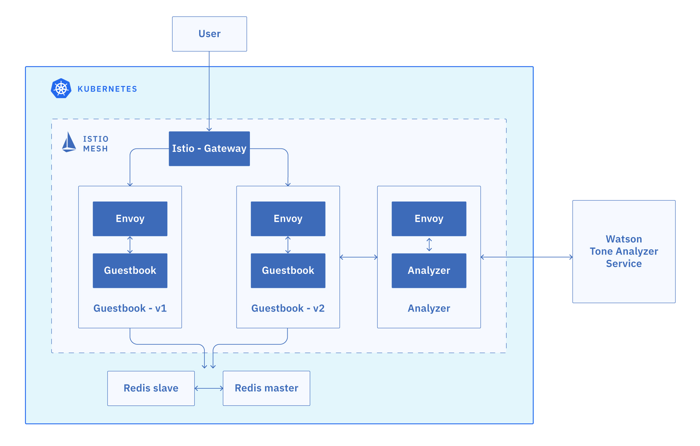
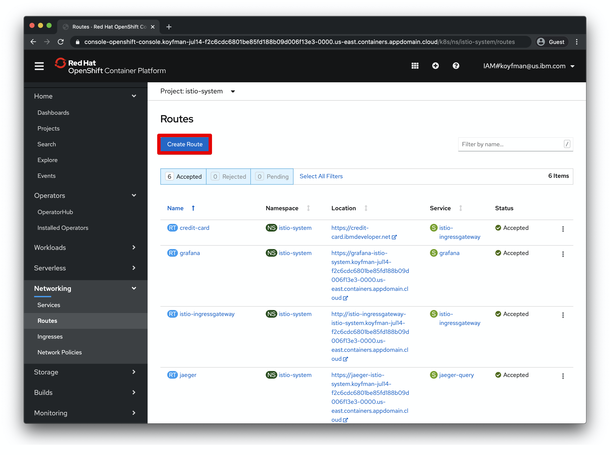
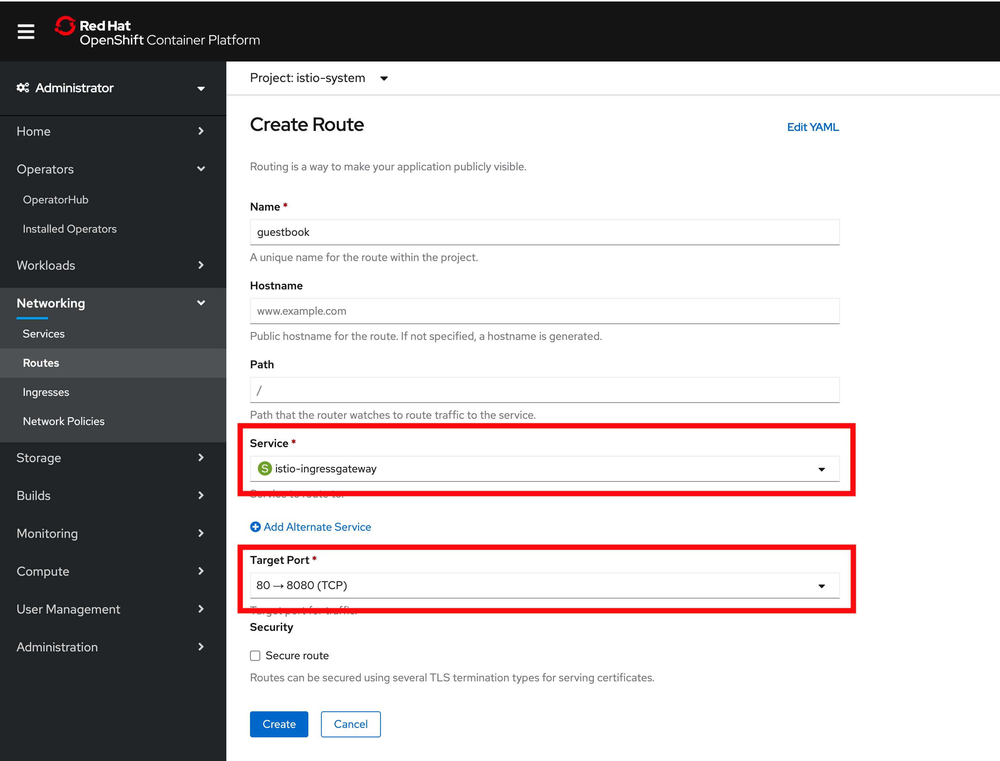
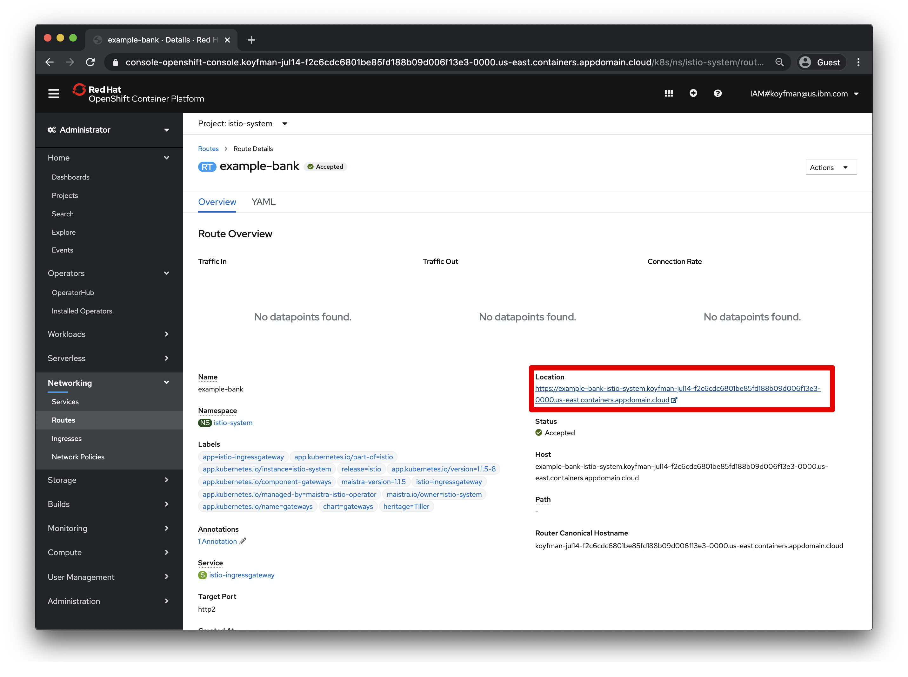

# Exercise 5 - Expose the service mesh with the Istio Ingress Gateway

The components deployed on the service mesh by default are not exposed outside the cluster.

An Ingress Gateway resource can be created to allow external requests through the Istio Ingress Gateway to the backing services.



## Expose the Guestbook app with Ingress Gateway

1. Configure the guestbook default route with the Istio Ingress Gateway. The `guestbook-gateway.yaml` file is in this repository (istio101) in the `workshop/plans` directory.

```shell
cd ../../plans
kubectl create -f guestbook-gateway.yaml
```

## Verify deployment and create a secure route with OpenShift

Now, let's expose the application in OpenShift with a route. 

1. Select the `istio-system` project, go to Networking->Routes, and select "Create Route"



2. Set the values as shown in the red boxes here. We are creating a route to the istio ingress gateway.



5. The application should now be available at this URL:




## References

* [Kubernetes Ingress](https://kubernetes.io/docs/concepts/services-networking/ingress/)

* [Istio Ingress](https://istio.io/docs/tasks/traffic-management/ingress.html)

